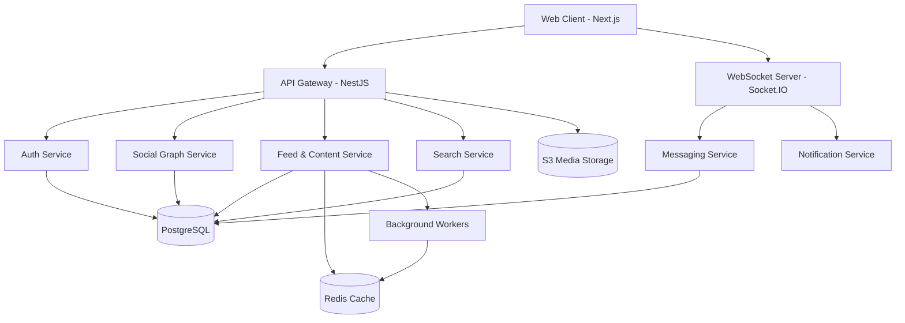

# System Architecture: EDAP Social

## 1. High-Level Architecture
EDAP Social uses a modern, scalable client-server architecture with a clear separation of concerns to handle high concurrency and real-time features.

- **Frontend:** Next.js (React) for SSR, SEO optimization, and dynamic routing. TailwindCSS + Framer Motion for original, premium UI/UX.
- **Backend:** NestJS (Node.js) providing a modular, strongly typed API.
- **Database:** PostgreSQL (primary data store for users, posts, relationships).
- **Caching & Queues:** Redis for session caching, feed ranking caching, and background job queues (BullMQ).
- **Real-Time:** Socket.IO for chat, typing indicators, and real-time notifications.
- **Storage:** S3-compatible object storage (AWS S3 or MinIO for local dev) for media (images/videos).
- **Search:** PostgreSQL Full-Text Search (initial phase) with an upgrade path to ElasticSearch.

## 2. Component Diagram

## 3. Data Flow & Feed Strategy
1. **Feed Generation Strategy (Hybrid approach for scale):**
   - **Fan-Out on Write (Push):** For standard users, when they create a post, background workers push the post ID into the Redis feed timelines of their followers.
   - **Fan-In on Read (Pull):** For high-profile accounts (e.g., >10k followers), their posts are NOT pushed to all followers to avoid huge resource spikes. Instead, when a user loads their feed, the system pulls recent posts from these high-profile accounts and merges them into the cached timeline.
2. **Pagination:** The feed relies strictly on **cursor-based pagination** (using the post's timestamp or a custom opaque cursor) to ensure stability when new posts are inserted, avoiding the offset jumping issues of traditional pagination.
3. **Caching:** Feed structures are cached in Redis to minimize DB load.

## 4. Real-Time & WebSockets
- **WebSocket Auth:** Connections are authenticated during the upgrade handshake via JWT. Invalid or expired tokens result in rejected socket connections.
- **State Management:** Redis Pub/Sub is used to synchronize WebSocket events across multiple server instances horizontally.

## 5. Deployment Strategy
- **Containerization:** Docker Compose for local development (App, Postgres, Redis, MinIO).
- **CI/CD:** Automated pipelines for linting, testing, and building images.
- **Infrastructure:** Kubernetes or managed services (AWS ECS/RDS) for production scaling.
