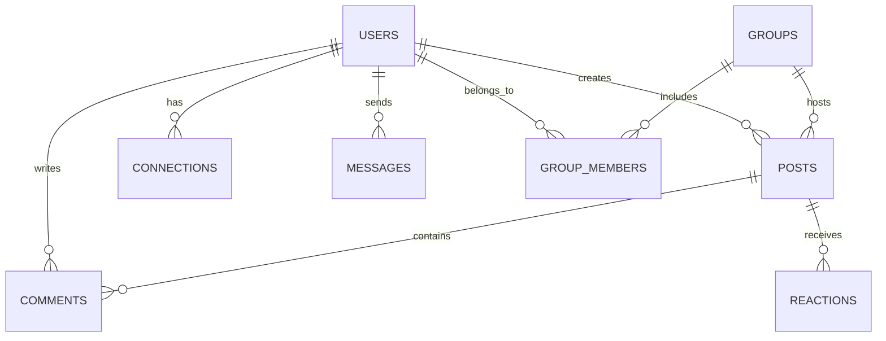

# Database Schema: EDAP Social

## 1. Entity Relationship Diagram

## 2. Core Tables

### Users
- `id` (UUID, PK)
- `email` (String, Unique)
- `password_hash` (String)
- `first_name` (String)
- `last_name` (String)
- `bio` (Text)
- `avatar_url` (String)
- `cover_url` (String)
- `is_verified` (Boolean)
- `role` (Enum: USER, ADMIN, MODERATOR)
- `created_at` (Timestamp)
- `updated_at` (Timestamp)

### Connections (Friends/Followers)
- `follower_id` (UUID, FK -> Users)
- `following_id` (UUID, FK -> Users)
- `status` (Enum: PENDING, ACCEPTED, BLOCKED)
- `created_at` (Timestamp)
- *Composite PK (follower_id, following_id)*

### Posts
- `id` (UUID, PK)
- `author_id` (UUID, FK -> Users)
- `content` (Text)
- `media_urls` (JSONB)
- `privacy` (Enum: PUBLIC, FRIENDS, PRIVATE)
- `group_id` (UUID, FK -> Groups, Nullable)
- `created_at` (Timestamp)
- `updated_at` (Timestamp)

### Comments
- `id` (UUID, PK)
- `post_id` (UUID, FK -> Posts)
- `author_id` (UUID, FK -> Users)
- `parent_comment_id` (UUID, FK -> Comments, Nullable for nesting)
- `content` (Text)
- `created_at` (Timestamp)

### Reactions
- `id` (UUID, PK)
- `user_id` (UUID, FK -> Users)
- `entity_type` (Enum: POST, COMMENT)
- `entity_id` (UUID)
- `reaction_type` (Enum: LIKE, LOVE, HAHA, WOW, SAD, ANGRY)
- `created_at` (Timestamp)

### Messages
- `id` (UUID, PK)
- `thread_id` (UUID)
- `sender_id` (UUID, FK -> Users)
- `content` (Text)
- `media_url` (String, Nullable)
- `read_at` (Timestamp, Nullable)
- `created_at` (Timestamp)

### Groups
- `id` (UUID, PK)
- `name` (String)
- `description` (Text)
- `privacy` (Enum: PUBLIC, PRIVATE)
- `owner_id` (UUID, FK -> Users)
- `created_at` (Timestamp)

### Notifications
- `id` (UUID, PK)
- `user_id` (UUID, FK -> Users)
- `type` (Enum: FOLLOW, COMMENT, LIKE, MENTION)
- `actor_id` (UUID, FK -> Users)
- `entity_id` (UUID)
- `is_read` (Boolean, default: false)
- `created_at` (Timestamp)

## 3. High-Performance Indexes
- **Posts (User Feed/Profile):** `CREATE INDEX idx_posts_author_created ON Posts(author_id, created_at DESC);`
- **Posts (Global/Chronological):** `CREATE INDEX idx_posts_created_at ON Posts(created_at DESC);`
- **Comments (Load by Post):** `CREATE INDEX idx_comments_post_created ON Comments(post_id, created_at ASC);`
- **Connections (Following Lookup):** `CREATE INDEX idx_connections_follower_status ON Connections(follower_id, status);`
- **Connections (Follower Lookup):** `CREATE INDEX idx_connections_following_status ON Connections(following_id, status);`
- **Messages (Load by Thread):** `CREATE INDEX idx_messages_thread_created ON Messages(thread_id, created_at DESC);`
